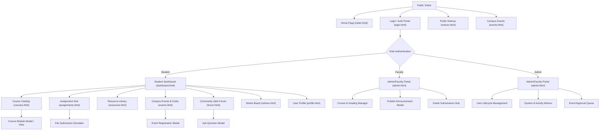

# StudentHub Site Map & Navigation Architecture

This document presents the complete Sitemap and Navigation Hierarchy for the **StudentHub** semester-long academic portal.

---

## 1. High-Level Visual Sitemap (Mermaid Diagram)

---

## 2. Page & Route Matrix

| # | Page File | Title | Primary Role(s) | Key Features |
|---|---|---|---|---|
| 1 | `index.html` | Public Home Landing | All / Guest | Portal highlights, feature overview, quick stats, login prompt |
| 2 | `login.html` | Login & Role Switcher | All / Guest | Interactive role selection (Student, Faculty, Admin), demo login |
| 3 | `dashboard.html` | Student Dashboard | Student | Enrolled course cards, GPA preview, attendance %, upcoming deadlines |
| 4 | `courses.html` | Course Directory | Student, Faculty | Filter by semester, syllabus preview, instructor bios, module content |
| 5 | `assignments.html` | Assignment Hub | Student, Faculty | Active assignments list, file upload mock, grade history & feedback |
| 6 | `resources.html` | Digital Library | Student, Faculty | Search past exam papers, lecture notes, textbook PDFs with filters |
| 7 | `events.html` | Events & Student Clubs | All | Calendar view, RSVP tracking, club directory, workshop signup |
| 8 | `forum.html` | Community Q&A | Student, Faculty | Peer Q&A threads, tag filters, upvote system, mark solution |
| 9 | `notices.html` | Notice Board | All | Urgency flags (Urgent, Academic, Exam), department filtering |
| 10 | `admin.html` | Admin & Faculty Control | Admin, Faculty | User approvals, course creator, notice publisher, system metrics |
| 11 | `profile.html` | Profile & Preferences | All Enrolled | Academic record, security settings, notification toggles, theme switcher |

---

## 3. Global Navigation Blueprint

- **Global Header Navbar**:
  - **Brand**: StudentHub logo + badge (Live / Wireframe mode toggle)
  - **Nav Links**: Home, Dashboard, Courses, Assignments, Resources, Events, Forum, Notices
  - **Right Controls**: Role Switcher Badge, Quick Search, Notifications Bell (with badge counter), Profile Avatar dropdown

- **Global Footer**:
  - Quick links to all 11 pages
  - Emergency hotline & campus helpdesk contacts
  - Academic calendar quick link
  - Low-Fi Blueprint wireframe toggle button
