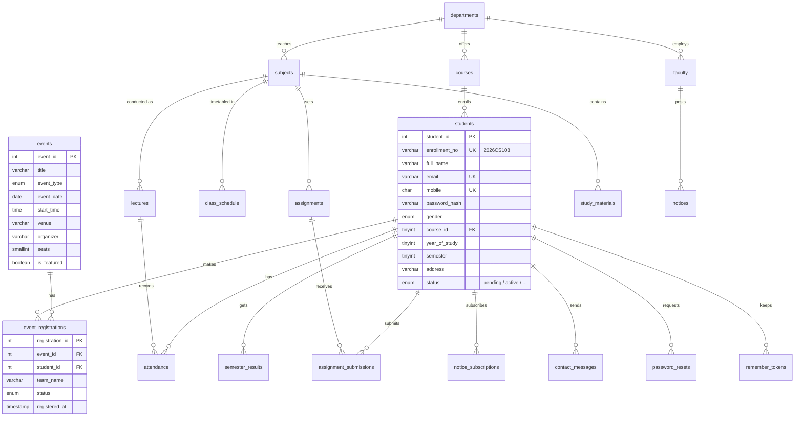

# StudentHub Database

MySQL / MariaDB database `studenthub`. 21 tables and 4 views cover every page in the portal.

## Setup

1. Start **Apache** and **MySQL** in the XAMPP control panel.
2. Import the scripts in order (phpMyAdmin → Import, or the terminal):
   ```
   /Applications/XAMPP/xamppfiles/bin/mysql -u root < database/schema.sql
   /Applications/XAMPP/xamppfiles/bin/mysql -u root < database/seed.sql
   ```
   ⚠️ `schema.sql` starts with `DROP DATABASE IF EXISTS studenthub`, so re-importing it wipes all data.
3. Open `php/db-test.php` in the browser to check the connection.

**Upgrading an existing database** (created before usernames were added): run each file in `database/migrations/` once, in order. They keep all existing data.
```
/Applications/XAMPP/xamppfiles/bin/mysql -u root < database/migrations/001_add_student_username.sql
```

Connection settings are in `php/config.php`. The defaults are XAMPP's: `root` with no password on `127.0.0.1:3306`.

Demo logins: `sneh.shah@university.edu` (or username `sneh.shah`) / `Student@123`, `admin@university.edu` / `Admin@123`.

## PHP endpoints

Run the site with `php -S localhost:8000 router.php` from `StudentHub/` (or through XAMPP's Apache).

| File | Method | What it does | Tables |
|---|---|---|---|
| `php/register.php` | POST | Validates the form, rejects a taken username/email/mobile, hashes the password with `password_hash()`, creates the student with an enrollment no. like `2026IT205` | `students`, `audit_logs` |
| `php/check-availability.php` | GET | Live "already taken?" check for username / email while typing | `students` |
| `php/login.php` | POST | Checks email **or username** + password, starts the session, optional remember-me cookie, locks out after 5 failed tries in 15 min | `students`, `remember_tokens`, `audit_logs` |
| `php/logout.php` | POST | Ends the session and deletes the remember-me token | `remember_tokens` |
| `php/me.php` | GET | Logged-in student's profile and dashboard stats as JSON (401 if logged out) | views + `assignments`, `study_materials` |
| `php/contact.php` | POST | Saves a support ticket, linked to the student when logged in | `contact_messages` |

Shared code: `php/db.php` (connection + prepared statements), `php/lib.php` (responses, sanitizing), `php/auth.php` (sessions).

## Tables by page

| Page / feature | Tables |
|---|---|
| Register, Login, Profile | `students`, `courses`, `departments`, `password_resets`, `remember_tokens` |
| Admin dashboard | `faculty`, `students.status` / `approved_by`, `audit_logs`, view `v_admin_stats` |
| Student dashboard | `class_schedule` (today's schedule), `semester_results` (CGPA), view `v_student_profile` |
| Attendance | `subjects`, `lectures`, `attendance`, view `v_attendance_summary` |
| Assignments | `assignments`, `assignment_submissions` |
| Materials | `study_materials` |
| Notices | `notices`, `notice_subscriptions` |
| Events (notices page + home carousel) | `events`, `event_registrations`, view `v_event_seats` |
| FAQ | `faqs` |
| Contact | `contact_messages` |

## ER diagram



## Design notes

- **Passwords and reset codes** are only stored as hashes (`password_hash()`).
- **Attendance** has one row per student per lecture. Percentages are calculated by `v_attendance_summary`, never stored, so they can't get out of sync.
- **Unique keys** block duplicate emails, mobile numbers, enrollment numbers and double event registrations. **CHECK constraints** validate the mobile format, years, semesters, GPAs and message length.
- **Foreign keys**: deleting a student removes their own records (`CASCADE`). Deleting a faculty account keeps the content they posted (`SET NULL`).
- `notices` and `faqs` have `FULLTEXT` indexes for fast search.
